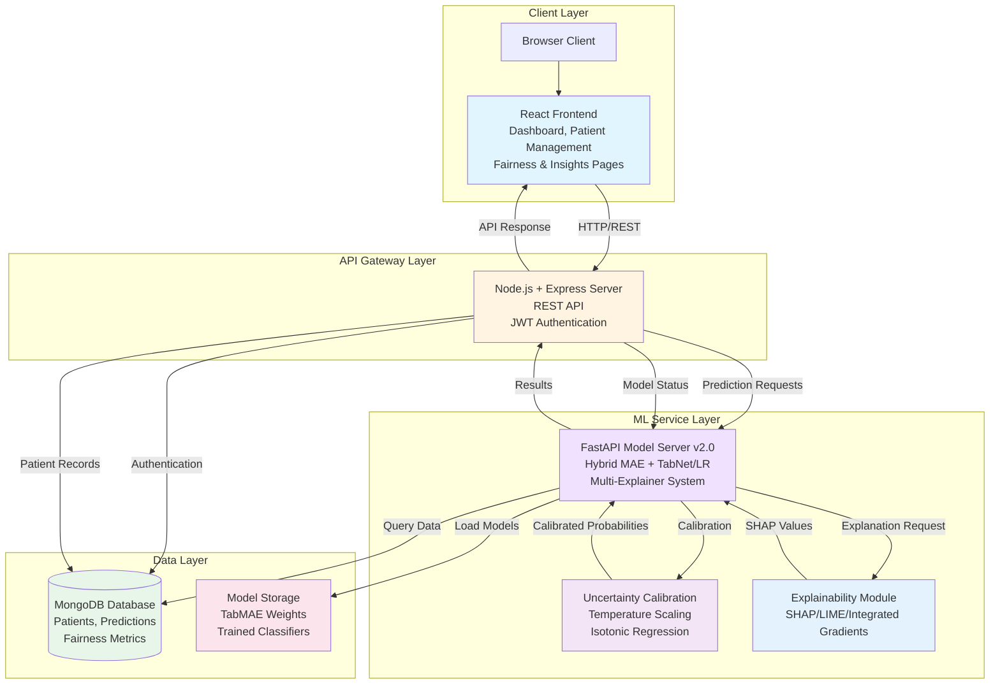
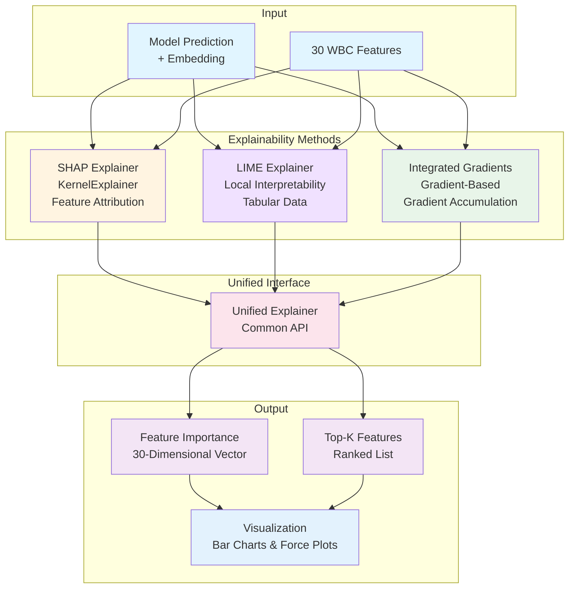
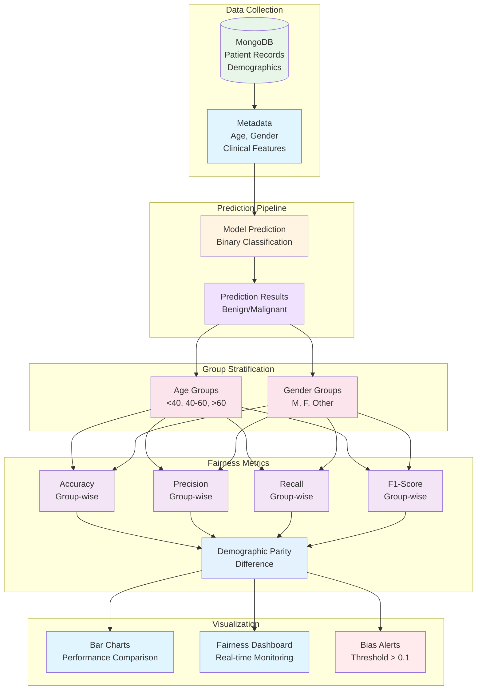
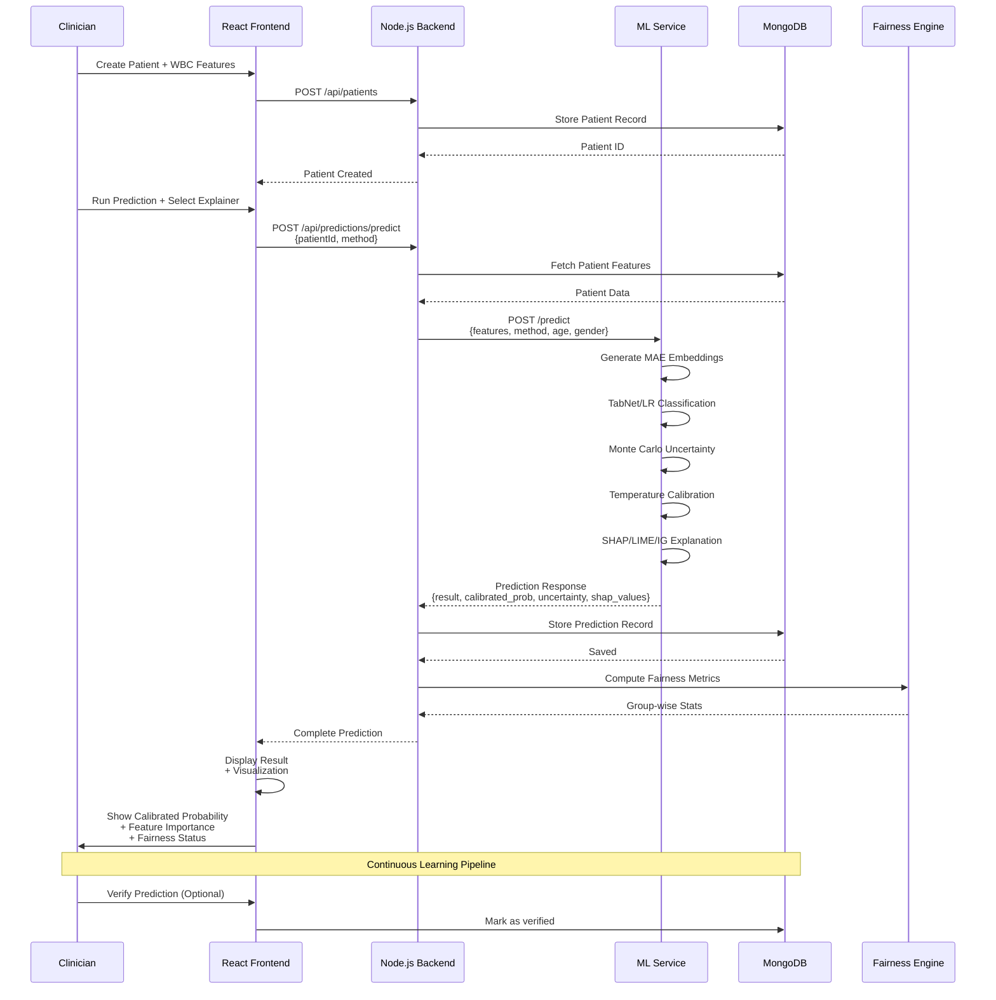
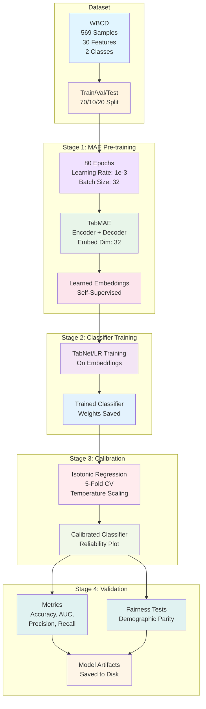
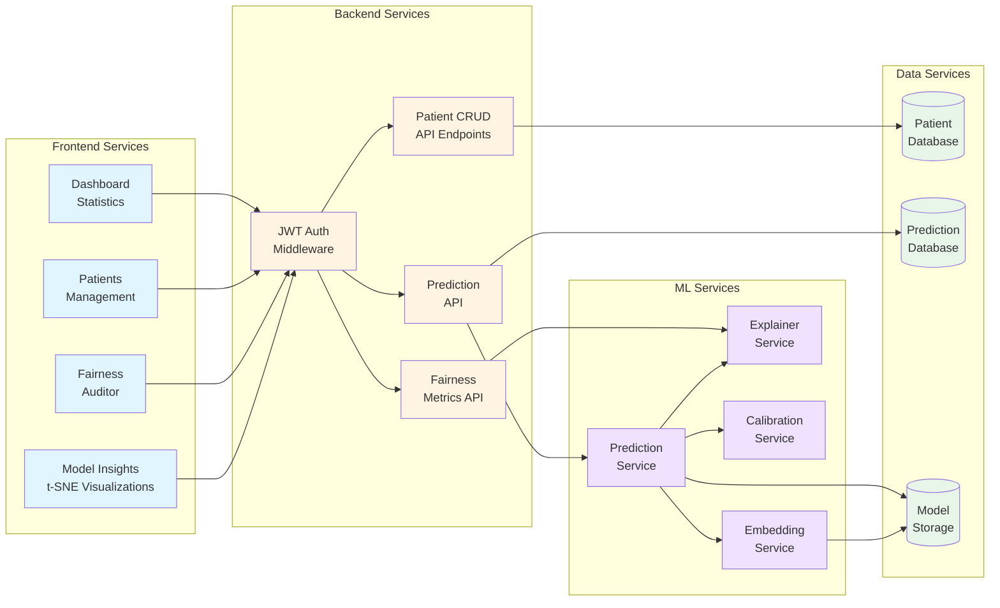
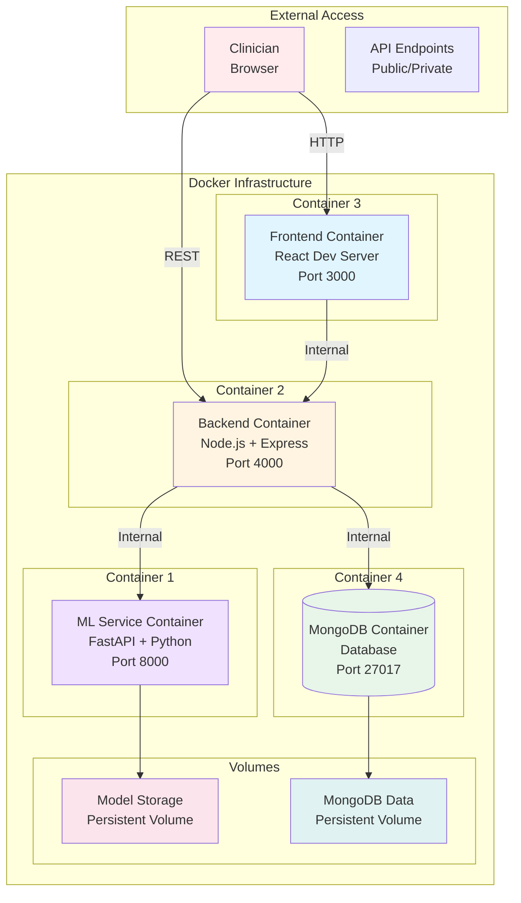

```mermaid
graph LR
    subgraph "Input Layer"
        Features[30 WBC Features<br/>Wisconsin Breast Cancer Dataset]
    end
    
    subgraph "Stage 1: Self-Supervised Learning"
        MAE[Masked Autoencoder<br/>Masking Ratio: 25%<br/>Encoder-Decoder Architecture]
        Embed[32-Dimensional<br/>Embeddings]
    end
    
    subgraph "Stage 2: Classification"
        TabNet{TabNet<br/>Available?}
        LR[Logistic Regression<br/>Standard Classifier]
        Classifier[Binary Classifier<br/>Benign/Malignant]
    end
    
    subgraph "Stage 3: Calibration & Uncertainty"
        MC[Monte Carlo Dropout<br/>Uncertainty Estimation]
        Cal[Temperature Scaling<br/>Isotonic Regression]
        Output[Calibrated Probability<br/>Confidence Interval<br/>Prediction Class]
    end
    
    Features -->|Feature Scaling| MAE
    MAE -->|Masked Reconstruction| Embed
    Embed -->|Embedded Representation| TabNet
    Embed -->|Embedded Representation| LR
    
    TabNet -->|Yes| Classifier
    LR -->|No| Classifier
    
    Classifier --> MC
    MC --> Cal
    Cal --> Output
    
    style Features fill:#e1f5ff
    style MAE fill:#fff4e1
    style Embed fill:#f0e1ff
    style TabNet fill:#e8f5e9
    style LR fill:#e8f5e9
    style Classifier fill:#fce4ec
    style MC fill:#f3e5f5
    style Cal fill:#f3e5f5
    style Output fill:#e3f2fd
```

# Research Paper Diagrams for WBC Diagnostic System v2.0

## 🏗️ 1. System Architecture Overview

### Mermaid Diagram Code:

**Research Paper Description:**
*"Figure 1: System Architecture - The proposed WBC diagnostic system employs a three-tier architecture. The client layer (React) provides an interactive dashboard with fairness auditing and model insights. The API gateway (Node.js) manages authentication and routes requests. The ML service (FastAPI) implements a hybrid Masked Autoencoder with TabNet architecture, augmented with multi-explainer explainability and uncertainty calibration. All data persists in MongoDB with separate storage for trained model artifacts."*

---

## 🔄 2. Hybrid ML Architecture (MAE + TabNet)

### Mermaid Diagram Code:

**Research Paper Description:**
*"Figure 2: Hybrid ML Architecture - The proposed hybrid approach consists of three stages. Stage 1 employs a Masked Autoencoder (MAE) for self-supervised pre-training, learning robust 32-dimensional embeddings through masked feature reconstruction. Stage 2 performs classification using either TabNet (with attention mechanisms) or Logistic Regression on embeddings. Stage 3 applies Monte Carlo dropout for uncertainty quantification and temperature scaling/isotonic regression for probability calibration, yielding trustworthy predictions with calibrated confidence intervals."*

---

## 🧠 3. Multi-Explainer Explainability Framework

### Mermaid Diagram Code:

**Research Paper Description:**
*"Figure 3: Multi-Explainer Framework - We implement three complementary explainability methods: (1) SHAP provides Shapley values for feature attribution based on cooperative game theory, (2) LIME offers local linear approximations for individual predictions, and (3) Integrated Gradients compute gradient-based attributions through path integration. All methods operate through a unified interface, mapping embedding-level explanations back to original feature space and providing ranked feature importance for clinical interpretability."*

---

## 📊 4. Fairness Auditing Pipeline

### Mermaid Diagram Code:

**Research Paper Description:**
*"Figure 4: Fairness Auditing Pipeline - Our system implements comprehensive fairness monitoring by stratifying predictions across demographic groups (age: <40, 40-60, >60 years; gender: M, F, Other). Group-wise performance metrics (accuracy, precision, recall, F1) are computed alongside demographic parity differences. Real-time visualization through interactive dashboards enables continuous monitoring, with automated alerts triggered when demographic parity exceeds acceptable thresholds (>0.1), ensuring ethical AI deployment in clinical settings."*

---

## 🔄 5. End-to-End Prediction Flow

### Mermaid Diagram Code:

**Research Paper Description:**
*"Figure 5: End-to-End Prediction Workflow - The clinical prediction workflow: (1) clinician inputs patient WBC features, (2) system generates hybrid embeddings and classifications with uncertainty quantification, (3) multi-explainer module produces feature attributions, (4) fairness engine computes demographic parity, (5) calibrated probabilities and explanations are returned to clinician. The system supports continuous learning through verified prediction flags, enabling future model retraining on human-verified cases."*

---

## 🎓 6. Training Pipeline

### Mermaid Diagram Code:

**Research Paper Description:**
*"Figure 6: Model Training Pipeline - Our training procedure employs a four-stage pipeline: (1) Self-supervised MAE pre-training on all features for 80 epochs with 25% masking ratio, (2) Supervised classifier training using TabNet or Logistic Regression on learned 32-dimensional embeddings, (3) Probability calibration via 5-fold cross-validated isotonic regression, and (4) Comprehensive validation including performance metrics and fairness audits across demographic groups. All model artifacts are persisted for reproducible deployment."*

---

## 📈 7. System Components Interaction

### Mermaid Diagram Code:

**Research Paper Description:**
*"Figure 7: System Component Architecture - The distributed architecture separates concerns across four layers: Frontend (React components for dashboard, patient management, fairness monitoring, and model insights), Backend (RESTful API with JWT authentication), ML Services (specialized modules for prediction, explanation, calibration, and embedding generation), and Data Services (MongoDB collections for patients, predictions, and model artifacts). This modular design enables independent scaling and maintenance of each component."*

---

## 🚀 8. Deployment Architecture

### Mermaid Diagram Code:

**Research Paper Description:**
*"Figure 8: Containerized Deployment - The system is deployed using Docker Compose orchestration with four independent containers: ML service (FastAPI), backend (Node.js), frontend (React), and database (MongoDB). Persistent volumes ensure model artifacts and database records survive container restarts. Internal networking enables secure service-to-service communication while exposing only necessary ports (3000, 4000, 8000) to external access. This containerized approach ensures reproducibility and simplifies scaling."*

---

## 📝 Quick Reference for Draw.io

### Color Scheme
- **Frontend/UI**: `#e1f5ff`
- **Backend/API**: `#fff4e1`
- **ML Services**: `#f0e1ff`
- **Database**: `#e8f5e9`
- **Model Storage**: `#fce4ec`
- **Special Services**: `#f3e5f5`
- **Visualization**: `#e3f2fd`
- **Alerts**: `#ffebee`

### Shape Recommendations
- **Rectangles**: Services, Components
- **Cylinders**: Databases, Storage
- **Diamonds**: Decision points
- **Parallelograms**: Input/Output
- **Rounded rectangles**: Processes

---

## 📊 Suggested Figure Numbers for Paper

1. **Figure 1**: System Architecture Overview
2. **Figure 2**: Hybrid ML Architecture (MAE + TabNet)
3. **Figure 3**: Multi-Explainer Framework
4. **Figure 4**: Fairness Auditing Pipeline
5. **Figure 5**: End-to-End Prediction Sequence
6. **Figure 6**: Training Pipeline
7. **Figure 7**: Component Interaction Architecture
8. **Figure 8**: Deployment Infrastructure

Each figure can be copied into Draw.io using the Mermaid code or recreated manually with the structure provided.

